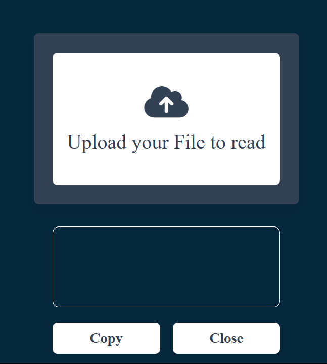

# 📷 QR Scanner

A fast and reliable QR code scanner that lets you scan QR codes using your camera or an uploaded image.

## 🔥 Features
✅ Scan QR codes in real-time using your webcam.  
✅ Upload an image to decode its QR code.  
✅ Extract and display text, URLs, or other encoded information.  
✅ Simple, lightweight, and user-friendly.  

## 🚀 Technologies Used
- **Frontend:** HTML, CSS, JavaScript  
- **QR Scanner Library:** `jsQR`, `qr-scanner`  
- **(Optional)** Backend: Node.js, Express.js  


 
## 📦 How to Use

### 1️⃣ Clone the Repository  
```sh
git clone https://github.com/KIHs0/qr-scanner.git
cd qr-scanner


